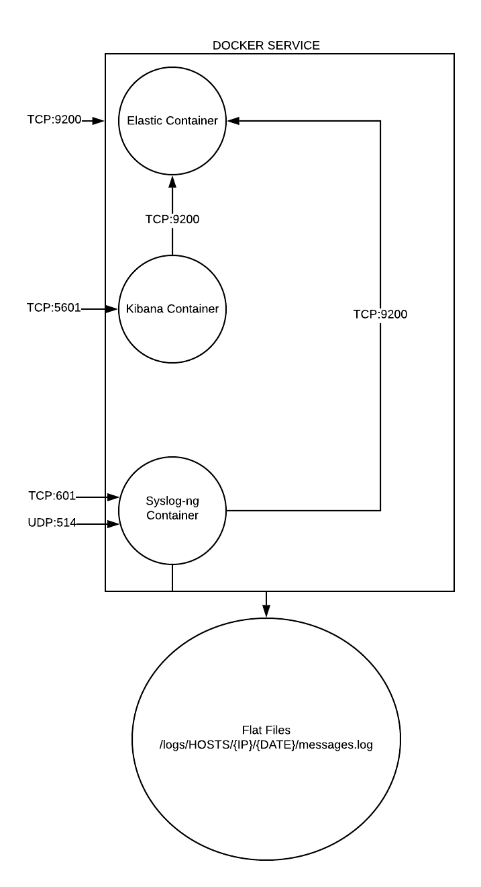

# Synopsis
This package has been created as a way to easily deploy a System-Of-Record. The logs will be kept on the parent system, so it will be maintained or accessible ouside of the docker container.

# Overview

 This is a snapshot to help understand what is going on.
Assume overview is running as a docker service on a physical host or virtual machine.

# Hardware Requirements
TODO

# Prerequisites
* Sudo access to a linux box
* Internet access to download software

# Installation

## Install Prerequisites

1. Install latest updates and docker
	1. <code> sudo apt update </code>
	1. <code> sudo apt-get install apt-transport-https ca-certificates curl software-properties-common </code>
	1. <code> curl -fsSL https://download.docker.com/linux/ubuntu/gpg | sudo apt-key add - </code>
	1. <code> sudo add-apt-repository "deb [arch=amd64] https://download.docker.com/linux/ubuntu $(lsb_release -cs)  stable"</code>
	1. <code> sudo apt update </code>
	1. <code> sudo apt-get install docker-ce </code>
1. Install Docker Compose
	1. <code> sudo curl -L https://github.com/docker/compose/releases/latest -o /usr/local/bin/docker-compose </code>
	1. <code> sudo chmod +x /usr/local/bin/docker-compose </code>
1. Prep directories
	1. <code> sudo mkdir -p /opt/secops </code>
	1. <code> sudo mkdir -p /logs/HOSTS </code>
1. Install git and jq
	1. <code> sudo apt install git jq </code>

## Configuration
1. Make sure you have enough vm mappings available
	1. <code> sudo sysctl -w vm.max_map_count=262144</code>

## Create and Assign Local User
1. Create a local logs group
	1. <code> groupadd -g 1111 logs </code>
1. Create a local user and add to logs group
	1. <code> useradd -u 1111 -g 1111 logs </code>
1. Change ownership and permisisons of /logs directory
	1. <code> chown -R logs:logs /logs </code>
	1. <code> chmod -R 750 /logs </code>

## Download Package
1. <code> cd /opt/secops </code>
1. <code> git clone git@github.com:guardsight/gsvsoc_docker-system-of-record.git </code>

## Build and Start
1. <code> cd /opt/secops/gsvsoc_docker-system-of-record </code>
1. <code> docker-compose -p 'gsvsoc-system-of-record' up --build -d </code>
1. Wait up to 10 minutes for the startup process to complete
1. Test using the following curl command
	1. <code> curl -L http://127.0.0.1:5601 </code>
	1. If you get a large response, then the platform is up.

## Stop Container
1. <code> cd /opt/secops/gsvsoc_docker-system-of-record </code>
1. <code> docker-compose -p 'gsvsoc-system-of-record' down </code>

## Clean up Containers
1. <code> cd /opt/secops/gsvsoc_docker-system-of-record </code>
1. <code> bash docker-cleanup.sh </code>

## Update
1. <code> cd /opt/secops/gsvsoc_docker-system-of-record </code>
1. <code> docker-compose -p 'gsvsoc-system-of-record' down </code>
1. <code> bash docker-cleanup.sh </code>
1. <code> git pull </code>
1. <code> docker-compose -p 'gsvsoc-system-of-record' up --build -d </code>
1. Wait up to 10 minutes for the startup process to complete
1. Test using the following curl command
	1. <code> curl -L http://127.0.0.1:5601 </code>
	1. If you get a large response, then the platform is up.
	
# Usage

## Raw logs

 The logs are stored in /logs/HOSTS/{HOST}/{DATE}/messages.log[.gz] 
You can grep or zgrep through these logs and correlate or filter down the data you want 
NOTE: This data will be there until the data is moved or purged.

## Kibana

You are able to view the Kibana dashboard at http://127.0.0.1:5601  
The prebuilt visualizations are store at http://127.0.0.1:5601/TODO 
NOTE: This data will be there for 31 days, then will automatically be purged.

## Elastic

You are able to access the raw elastic indexes at http://127.0.0.1:9200/gs-es-{DATE} 
The data will also be available via the Kibana portal 
NOTE: This data will be there for 31 days, then will automatically be purged.

1. Use elastic queries via http://127.0.0.1:9200

# Scheduled Tasks
1. /etc/cron.daily/GSVSOC-logs-compress.sh
	1. Runs daily and compresses the messages.log files in /logs/HOSTS
1. /etc/cron.daily/GSVSOC-purge-es-data.sh
	1. Runs daily and purges any elastic data older than 31 days

# Debugging
## gsvsoc-system-of-record container bash access
1. <code> docker exec -it gsvsoc-system-of-record /bin/bash </code>

## Test Case
1. The following is meant to be run from the parent machine
1. <code> echo "testing_tcp"  | nc -w1 127.0.0.1 601  </code>
1. <code> echo "testing_udp" | nc -ulW 1 127.0.0.1 514 </code>
1. Wait at least 20 seconds, and then verify the log has appeared
1. Check raw logs for existence
	1. <code> zgrep -E "testing_(tcp)|(udp)" /logs/HOSTS/\*/"$(date +'%F')"/\* </code>
1. Check Elastic-Stack for existence
	1. <code> curl -s -XGET http://127.0.0.1:9200/gsvsoc-es-$(date +"%F")/\_search?q=PROGRAM:testing_\* | jq .hits.total.value </code>
	1. Make sure the value is at least 1

# See
* https://wiki.guardsight.com/wiki/Instruction:W-0021_-_How-To_Create_A_Syslog_Infrastructure
